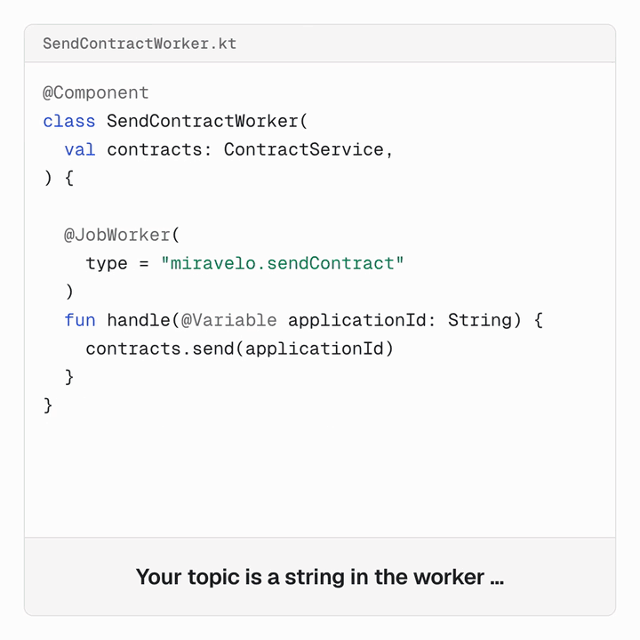

[](https://miragon.github.io/bpmn-to-code/)
[](https://bpmn-to-code.miragon.io/static/index.html)
[](https://central.sonatype.com/artifact/io.miragon/bpmn-to-code-maven)
[](https://plugins.gradle.org/plugin/io.miragon.bpmn-to-code-gradle)

# bpmn-to-code

Type-safe constants from your BPMN model, for your compiler, your tests and your AI agents.


bpmn-to-code reads your BPMN files and generates a typed API from them. Element ids, message names and job types become constants, so renaming a task in the modeler is a compiler error instead of a silent runtime failure.

```kotlin
// Before: copied from the modeler, no safety net
@JobWorker(type = "miravelo.sendContract")
fun send() { ... }

// After: generated from the BPMN model
@JobWorker(type = ServiceTasks.MIRAVELO_SEND_CONTRACT)
fun send() { ... }
```

Around the generator:

- **[Validation](https://miragon.github.io/bpmn-to-code/validate/)**: built-in rules run before every generation, as a build task, or as tests with `bpmn-to-code-testing`, where you can add your own rules.
- **[Process JSON](https://miragon.github.io/bpmn-to-code/surface/json)**: a compact JSON view of each process for reviews, CI and AI agents.
- **[Agent skills](https://miragon.github.io/bpmn-to-code/skills/)**: a Claude Code plugin that sets up the build plugin and migrates hardcoded strings.
- **[Web app](https://bpmn-to-code.miragon.io/static/index.html)**: try it in the browser, or self-host the [Docker image](https://hub.docker.com/r/miragon/bpmn-to-code-web).

## What it helps with

A BPMN model and the code around it drift apart quietly: someone changes a name in the modeler and nothing tells the code. With the generated API, that change shows up in your build after you regenerate.

### In production code

A worker that carries its topic as a string keeps compiling when the topic changes in the model, and the instance just waits. With the generated constant, the build points at the worker.



### In process tests

A test with hand-typed element ids only fails when it runs. Built from the generated flow nodes with [`ProcessPath`](https://miragon.github.io/bpmn-to-code/guide/process-path), it stops compiling instead.


### With any engine and any test framework

The clips show Camunda 8 and Kotlin, but nothing depends on that. The generated API is plain constants and objects, without a dependency on an engine, a worker library or a test framework. A `ProcessPath` hands you plain element ids, so it fits whatever flow assertion your test library offers. It works the same for every [supported engine](#supported-engines) and [output language](#supported-output-languages).

## Gradle

<!-- x-release-please-start-version -->
```kotlin
import io.miragon.bpmn.adapter.GenerateBpmnModelsTask
import io.miragon.bpmn.domain.shared.OutputLanguage
import io.miragon.bpmn.domain.shared.ProcessEngine

plugins {
    id("io.miragon.bpmn-to-code-gradle") version "6.2.0"
}

tasks.named("generateBpmnModelApi", GenerateBpmnModelsTask::class) {
    baseDir = projectDir.toString()
    filePattern = "src/main/resources/**/*.bpmn"
    outputFolderPath = "$projectDir/src/main/kotlin"
    packagePath = "com.example.process"
    outputLanguage = OutputLanguage.KOTLIN
    processEngine = ProcessEngine.ZEEBE
}
```
<!-- x-release-please-end -->

Run it with `./gradlew generateBpmnModelApi`. The plugin adds the `bpmn-to-code-runtime` dependency by itself. Details: [Gradle guide](https://miragon.github.io/bpmn-to-code/getting-started/gradle).

## Maven

The goals are not bound to a lifecycle phase by default, so bind the goal yourself, and add the runtime library the generated code refers to:

<!-- x-release-please-start-version -->
```xml
<dependencies>
    <dependency>
        <groupId>io.miragon</groupId>
        <artifactId>bpmn-to-code-runtime</artifactId>
        <version>6.2.0</version>
    </dependency>
</dependencies>

<build>
    <plugins>
        <plugin>
            <groupId>io.miragon</groupId>
            <artifactId>bpmn-to-code-maven</artifactId>
            <version>6.2.0</version>
            <executions>
                <execution>
                    <phase>generate-sources</phase>
                    <goals><goal>generate-bpmn-api</goal></goals>
                </execution>
            </executions>
            <configuration>
                <baseDir>${project.basedir}</baseDir>
                <filePattern>src/main/resources/*.bpmn</filePattern>
                <outputFolderPath>${project.basedir}/src/main/java</outputFolderPath>
                <packagePath>com.example.process</packagePath>
                <outputLanguage>JAVA</outputLanguage>
                <processEngine>ZEEBE</processEngine>
            </configuration>
        </plugin>
    </plugins>
</build>
```
<!-- x-release-please-end -->

Details: [Maven guide](https://miragon.github.io/bpmn-to-code/getting-started/maven). All parameters of both plugins: [Configuration](https://miragon.github.io/bpmn-to-code/guide/configuration).

## Supported engines

| Engine | `processEngine` |
|---|---|
| Camunda 8 / Zeebe | `ZEEBE` |
| Camunda 7, CIB seven | `CAMUNDA_7` |
| Operaton | `OPERATON` |

## Supported output languages

| Language | `outputLanguage` | Runtime types |
|---|---|---|
| Kotlin | `KOTLIN` | `io.miragon:bpmn-to-code-runtime` |
| Java | `JAVA` | `io.miragon:bpmn-to-code-runtime` |
| C# (experimental) | `CSHARP` | inlined into each generated file |

C# output is experimental and may change in a minor release. It is available in the Gradle plugin, the Maven plugin and the web app.

## Links

- [Documentation](https://miragon.github.io/bpmn-to-code/)
- [Why bpmn-to-code](https://miragon.github.io/bpmn-to-code/overview/why)
- [Changelog and migration guides](https://miragon.github.io/bpmn-to-code/changelog/)
- [Contributing](https://miragon.github.io/bpmn-to-code/contributing/)

Issues, pull requests and discussions are welcome on [GitHub](https://github.com/Miragon/bpmn-to-code).
