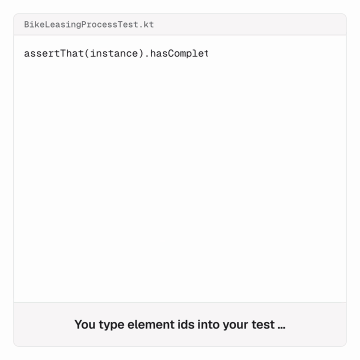

# 🧭 Asserting Flow with ProcessPath

`bpmn-to-code-runtime` ships `ProcessPath`, a path builder over the [generated `FlowNodes`](/guide/generated-api#flownodes). You walk a route through the process, then hand its `ids` to the flow assertion of your engine's test library. Because every step is typed by the model, **a path the model does not contain does not compile**: regenerate after a model change and the build breaks at the edge that moved.



It works in any process test that has the runtime on its classpath. Kotlin uses `ProcessPath` with extension steps, Java the fluent [`PathWalk`](#from-java).

```kotlin
import io.miragon.bpmn.runtime.path.ProcessPath
import io.miragon.bpmn.runtime.path.enter
import io.miragon.bpmn.runtime.path.inside
import io.miragon.bpmn.runtime.path.onto
import io.miragon.bpmn.runtime.path.then
import com.example.process.BikeLeasingProcessApi.FlowNodes

val path = ProcessPath.from(FlowNodes.StartEventLeasingRequestReceived)
    .then { it.serviceTaskValidateApplication }
    .then { it.businessRuleTaskCheckCreditRating }
    .then { it.gatewayIsSolvent }
    .onto { it.subProcessConcludeContract }
    .inside {
        enter { it.startEventCustomerEligible }
            .then { it.serviceTaskSendContract }
            .then { it.gatewayAwaitSignature }
            .then { it.eventContractSigned }
            .then { it.endEventContractConcluded }
    }
    .then { it.gatewayFork }
    .then { it.serviceTaskOrderBike }
    .then { it.gatewayJoin }
    .then { it.receiveTaskHandoverReported }
    .then { it.timerWithdrawalPeriodElapsed }
    .then { it.endEventLeasingActive }

assertThat(instance).hasPassedInOrder(*path.ids)
```

## Steps

| Step | Does | Records |
|------|------|---------|
| `ProcessPath.from(node)` | starts at any node of `FlowNodes` | the node |
| `then { it.x }` | moves to a successor; `it` is the current node's `Next` | the target and its sequence flow |
| `thenMultipleTimes(n) { it.x }` | the same, for a sequential multi-instance activity or a self-repeat | the target `n` times, the flow once |
| `onto { it.sub }` | moves onto a subprocess | only the flow |
| `enter { it.start }` | descends into the current subprocess; `it` is its `Start` | the inner node |
| `enter(FlowNodes.Sub) { it.start }` | descends into a named subprocess from anywhere | the inner node |
| `inside { enter { … }.then { … } }` | walks the interior of the current subprocess and returns to the subprocess node | what the block walked |
| `interruptedBy(FlowNodes.Host) { it.boundary }` | leaves `Host` through one of its boundary events | the boundary event |
| `throwingCompensation(boundary) { it.handler }` | records a compensation handler and stays on the current node | the handler |
| `jumpTo(node)` | re-anchors to any node without a check | nothing |

Gateways are passed at runtime, so walk them with `then`. A subprocess node is a bracket around its interior, not a point in the ordered flow: `onto` does not record it. Assert it separately if you need it.

After `inside`, the walk stands on the subprocess, so the next `then` continues with what follows it. A token that leaves the subprocess early through a boundary event is written with `interruptedBy` instead:

```kotlin
val path = ProcessPath.from(FlowNodes.StartEventCustomerEligible)
    .then { it.serviceTaskSendContract }
    .interruptedBy(FlowNodes.SubProcessConcludeContract) { it.boundaryContractNotSigned }
    .then { it.gatewayCollectRejections }
```

`jumpTo` is the only unchecked step. It is marked `@RiskyNavigation`, so Kotlin code has to opt in with `@OptIn(RiskyNavigation::class)`, which makes every use visible in review.

## What a path gives you

| Property | Kotlin | Java |
|----------|--------|------|
| Element ids in walk order | `ids` | `getIds()` |
| The same without duplicates | `distinctIds` | `getDistinctIds()` |
| Ids of the sequence flows walked | `flowIds` | `getFlowIds()` |
| The nodes themselves | `nodes` | `getNodes()` |

The three id properties are `Array<String>` / `String[]`, the type a string-vararg assertion takes: `hasPassedInOrder(*path.ids)` in Kotlin, `hasPassedInOrder(ids)` in Java.

`flowIds` holds a flow for each `then` and `onto` whose successor is unambiguous. Boundary events, compensation handlers and `enter` record none. When several flows lead to the same element, pick one from `flows`:

```kotlin
val path = ProcessPath.from(FlowNodes.BusinessRuleTaskCheckCreditRating)
    .then { it.gatewayIsSolvent }
    .then { it.subProcessConcludeContract }

assertThat(path.flowIds).containsExactly("flow_checkCreditRatingToIsSolvent", "flow_isSolventToConcludeContract")

// several flows to one element: pick by condition
.then { next -> next.taskApprove.flows.single { it.conditionExpression == "=customer.isVip" } }
```

::: info What is checked
The guarantee is structural: each step is an edge the model contains. It is not a simulation. A path can be valid in the model and still not be what the engine executes, since an exclusive gateway takes one branch and a parallel gateway all of them.
:::

## Parallel branches

An in-order assertion only makes sense within one sequential branch. Walk each parallel branch on its own and assert the unordered set with `nodesOf`:

```kotlin
val orderBranch = ProcessPath.from(FlowNodes.GatewayFork)
    .then { it.serviceTaskOrderBike }
    .then { it.gatewayJoin }
val insuranceBranch = ProcessPath.from(FlowNodes.GatewayFork)
    .then { it.serviceTaskIssueInsurancePolicy }
    .then { it.gatewayJoin }

val passed = nodesOf(orderBranch.nodes, insuranceBranch.nodes).map { it.id.value }
assertThat(instance).hasPassed(*passed.toTypedArray())
```

## Walking a compensated path

A compensation handler is not reached by a sequence flow. BPMN associates it with the compensation boundary event of the activity it compensates. Record the event that throws the compensation, then each handler it triggers: name the boundary event and pick the handler from its `Next`.

```kotlin
val path = ProcessPath.from(FlowNodes.StartEventApplicationWithdrawn)
    .then { it.eventReverseApplication }
    .throwingCompensation(FlowNodes.BoundaryCompensateContract) { it.serviceTaskCancelContract }
    .then { it.serviceTaskSendCancellationConfirmation }

assertThat(instance).hasPassedInOrder(*path.ids)
```

- In Kotlin the step only exists on a `CompensationThrowEvent`, and only a compensation boundary event offers a handler.
- The walk stays on the throwing event, because the token continues from there and not from the handler.
- **The boundary event is left out by default.** Zeebe reports a compensation boundary event as a passed element, Camunda 7 and Operaton do not. A path without it holds on all three as long as the assertion accepts further elements in between. To record it as well, pass `includeBoundaryEvent = true`: `throwingCompensation(boundary, includeBoundaryEvent = true) { … }`.
- A throw event without an `activityRef` triggers every handler in its scope in no defined order. Chain several `throwingCompensation` steps and assert the unordered set, or walk the handlers separately and unite them with `nodesOf`.

## From Java {#from-java}

`PathWalk` offers the same steps as instance methods; each lambda receives the current node's `Next`:

```java
String[] ids = PathWalk.from(FlowNodes.startEventLeasingRequestReceived())
    .then(n -> n.serviceTaskValidateApplication())
    .then(n -> n.boundaryApplicationInvalid())
    .then(n -> n.gatewayCollectRejections())
    .then(n -> n.serviceTaskSendRejection())
    .end(n -> n.endEventApplicationRejected())
    .getIds();

assertThat(instance).hasPassedInOrder(ids);
```

Three differences from Kotlin:

- **The last step is `end`.** An end event has no successors and cannot continue a chain. `end` returns a `Trail` with `getIds()`, `getDistinctIds()`, `getFlowIds()` and `getNodes()`.
- **Subprocess steps name the subprocess**: `enter(FlowNodes.subProcessConcludeContract(), s -> s.startEventCustomerEligible())` and `inside(FlowNodes.subProcessConcludeContract(), s -> PathWalk.from(s.startEventCustomerEligible())…end(…))`, where the block returns the `Trail` of the interior.
- **`throwingCompensation` is not restricted to compensation throw events**; the compiler cannot check that here. It also exists on `Trail`, for an end event that throws a compensation. To record the boundary event, pass `true` as second argument.

```java
String[] ids = PathWalk.from(FlowNodes.startEventApplicationWithdrawn())
    .then(n -> n.eventReverseApplication())
    .throwingCompensation(FlowNodes.boundaryCompensateContract(), n -> n.serviceTaskCancelContract())
    .then(n -> n.serviceTaskSendCancellationConfirmation())
    .end(n -> n.endEventApplicationCancelled())
    .getIds();
```

`PathWalk.nodesOf(…)` unites branches as in Kotlin.
